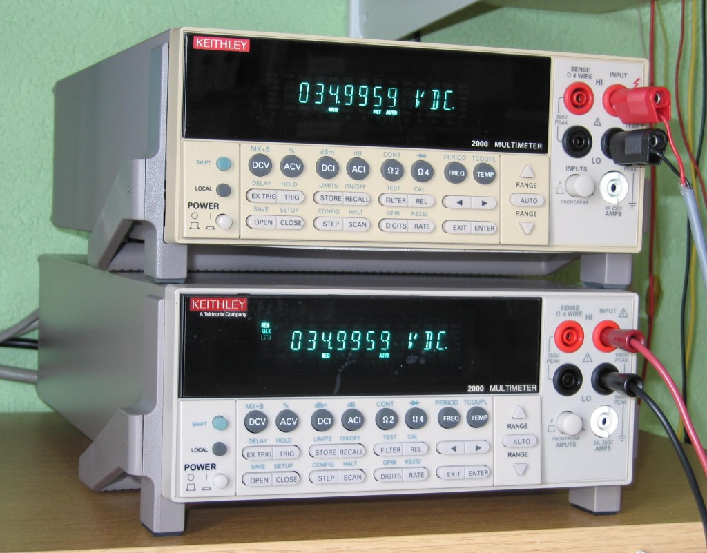
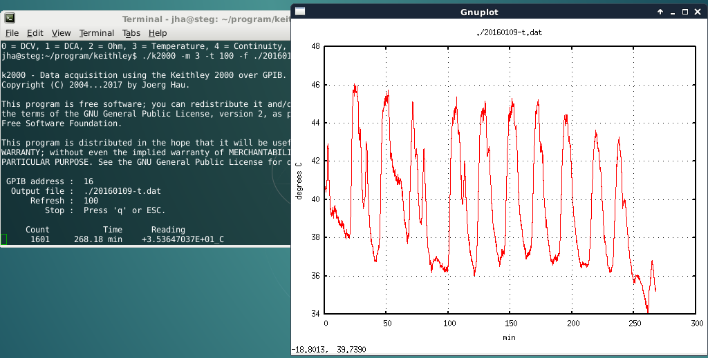

# README to k2000

## Name
k2000 - control the Keithley 2000 Digital Multimeter using GPIB

## Description
'k2000' is a program to access and control the Keithley 2000 Digital Multimeter (DMM) over GPIB under Linux. 
This software is fully functional, but of course it can still be extended : the SCPI programming language is full of possibilities ;-) 

Some features:
- set the DMM into some of its measuring modes (with autoranging)
- specify different data acquisition rates
- record and save data to file
- **graphical display** ("stripchart recorder") using gnuplot

## Requirements
- At least one Keithley 2000 instrument and a GPIB cable.
- A computer with Linux and a GPIB interface installed ;-)
- The [Linux-GPIB library](http://sourceforge.net/projects/linux-gpib/) must be installed and configured. You can find a short summary of the required steps at [schweizerschrauber.ch](https://www.schweizerschrauber.ch/sci/elec.html#gpib)
- The graphic display makes use of [gnuplot](http://www.gnuplot.info/), a free software for scientific data plotting. You need gnuplot v4 or later.
- The user accessing the instrument must have access rights to the GPIB instrumentation:
  - With recent versions of linux-gpib, make sure the user is in group 'gpib'.
  - With earlier versions of linux-gpib, either become root before running, or make the executable setuid root.

## Installation
To install, just compile the file(s) according to the instructions given at the beginning of the k2000.c file, then copy the corresponding executable to any 
location you desire (probably `/usr/local/bin` or `~/bin`). 

Invoke it by [typing its name](README.md#synopsis). As the program is a command-line utility, it needs to be run in a terminal window. 

## Synopsis
`k2000 [-h] [-a id] [-m mode] [-d] [-t dt] [-T timeout] [-w samp] [-f] [-c "txt"] [-g /path/to/gnuplot] [-n] datafile"`

### Options and defaults

    -h        show help
    -a id     use instrument at GPIB address 'id' (default is 16)
    -m mode   measurement mode (default is 0 for DCV). 
    -t dt     delay between measurements in 0.1 s (default is 10, i.e. 1 s)
    -d        disable instrument display (default is on)

    -w x      force write (flush) to disk every x samples (default is 100)
    -f        force overwriting of existing data file
    -T min    stop acquisition after this time (in minutes; default 0 = endless)
    -c "txt"    comment text, "enclose multiple words with quotes like this"
    -g /path/to/gnuplot
              if gnuplot is not in your PATH, you can specify it here.
    -n        no graphic display
    datafile  file where the data are stored (what else did you expect ? ;-)

## Running the Program

At startup, the software expects at least the name of the output data
file as an argument:

     k2000 path/to/file.dat
     
To select another measurement mode than DCV, use option `-m mode`, 
where `mode` is a number from 0 to 5 according to the function needed:

     0  DCV (default)
     1  DCA
     2  Ohm
     3  Temperature
     4  Continuity
     5  Diode

As an example, the following command would set DCA:

     k2000 -m 1 path/to/file.dat
    
Sampling intervals are specified using option `-t dt`, where `dt` specifies the intervals between sampling points in 0.1 s. `dt` must be in the range 0 to 600. Default is 10, i.e. 1 measurement per second (1 Hz).

The shortest interval that can be triggered by the computer in this software is 0.1 s (`-t 1`), which in turn enables a 10-Hz acquisition rate. 

For faster rates, just leave the software in a free-running mode, i.e. specify a sampling interval of 0 (`-t 0`). The sampling rate will then depend on your local setup.

You can blank the DMM display (option `-d`) to speed up acquisition.

Note: you could program faster rates with the `:AVER` command, or use the `:TRAC:POIN` or the `:SAMP:COUNT` subsystem(s) to quickly store multiple readings in a buffer and then read them. "This is left as an exercise to the user" ;-)

To stop an acquisition after a predefined time, use option `-T`. 
As an example, the following line would acquire temperature data and stop 
automatically after 1.5 minutes (90 seconds):

    k2000 -m 3 -T 1.5 path/to/file.dat

The other options should be rather self-explaining.

When the acquisition is finished and graphics mode was used (the default), 
the program leaves the plot window on screen for further evaluation until 
you press the "any" key ;-)

## Exit code

Exit code is
- 0 if program execution was successful,
- 1 if error in command line option
- 4 if file i/o problem
- 5 if communication problem with instrument

# Re-displaying the Data

The data files are tab-delimited ASCII files. To (re)display these
data e.g. in gnuplot, use something along the following lines:

    set style data lines
    set grid xt
    set grid yt
    set xlabel 'min'
    set ylabel 'V'
    set title 'filename'
    plot 'filename' ' with lines title ''

   

## License
This program and its documentation are Copyright (c) 2005...2025 Joerg Hau.

This program is free software; you can redistribute it and/or modify it
under the terms of the GNU General Public License version 2 (**not** "any later version") as published
by the Free Software Foundation, provided that the copyright notice
remains intact even in future versions. See the file LICENSE for details.

If you use this program (or any part of it) in another application, note
that the resulting application becomes also GPL. In other words, GPL is a
"contaminating" license.

This program is distributed in the hope that it will be useful, but WITHOUT
ANY WARRANTY; without even the implied warranty of MERCHANTABILITY or
FITNESS FOR A PARTICULAR PURPOSE.  See the GNU General Public License (file
LICENSE) for more details.

## ToDo
- There is almost no error checking and/or reading of error conditions from the DMM.
- Right upon startup, query for any static errors and act accordingly.
- Setting AC functions ("volt:ac", "curr:ac") results in an error. I almost don't use them, so I did not bother...

## History
See top of the k2000.c file. 

I started writing this software in 2004 (based on code I had developed for the Solartron S7150 multimeter) and it was published on my homepage all these years. 
It was only in 2025 that I decided to move it to GitHub :-)

I have initially developed this software on a Pentium-III 600 MHz with SuSE Linux 9.0, Kernel 2.4 and linux-gpib-3.1.101. 
In 2016, this same system was upgraded to Debian 8 with Kernel 3.16 and linux-gpib-4.0.2. I also switched from the old HP82335 ISA-slot card to an Agilent 82357B USB interface. 
As of 2025, we're on Debian 12 and no changes were necessary :-)

## Bugs
If you find any bugs related to this software, or if you want to contribute code, feel free to use the github tools.

In case of bugs: Please make sure you can reproduce the problem, and that the problem is really related to *this* software. 
As an example, I will _not_ answer any questions about compiling and/or configuring your GPIB hardware.

Thank you for your interest, and ... have fun!
